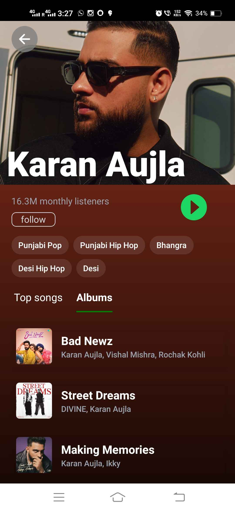
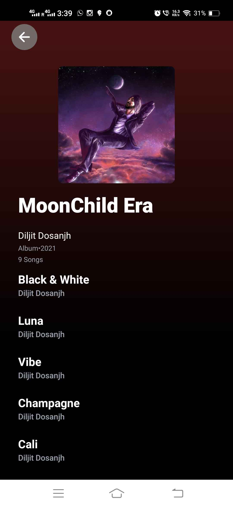

# Spotify Application

This project is a React Native Spotify clone application that allows users to authenticate via Spotify OAuth 2.0 and interact with the Spotify API to access and manage various features related to music and playlists. The app implements a wide range of functionalities, providing an intuitive and seamless music experience.

## Features

### 1. **User Authentication**
- Users can log in using their Spotify account via OAuth 2.0.
<p float="left">


</p>

### 2. **Home Screen**
- Displays featured recently played, new releases, and top artists to keep users engaged with fresh content.
<p float="left">


</p>

### 3. **Search Functionality**
- Users can search for songs, albums, artists, and playlists.
- Categorized search results make finding content easier.
<p float="left">


</p>
<p float="left">


</p>

### 4. **Artist Pages**
- Users can view detailed information about Artists.
- Includes top songs, album listings, and related artists.
<p float="left">



</p>

### 5. **Album Pages**
- displays a full list of tracks, including song titles, names of the artists and album information.
<p float="left">



</p>

### 6. **Playlist & Library Management**
- Users can view their own playlists.
- Fetches Followed playlists and manages libraries by following or unfollowing playlists.
- Fetches Followed Artist lists and Liked songs.
<p float="left">


</p>


### 7. **Liked Songs and Song Screen**
- Users can like or unlike songs.
- Displays the user's liked songs.
<p float="left">


</p>


### 7. **Drawer Navigation**
- A clean and efficient navigation system that allows users to easily access different sections of the app.
- Key sections include User Profile, complete list of recently played songs.
<p float="left">


</p>

## Tech Stack
- **Frontend**: React-Native.
- **Authentication**: Spotify OAuth 2.0.
- **API Integration**: Spotify Web API.
  
# Installation Guide

Follow these steps to set up and run the Spotify-like React Native application using Expo.

## Prerequisites

Before you begin, ensure that you have the following installed on your system:

- [Node.js](https://nodejs.org/en/download/) (v14 or later)
- [npm](https://www.npmjs.com/get-npm) (Node Package Manager)
- [Expo CLI](https://docs.expo.dev/get-started/installation/) (`npm install -g expo-cli`)
- [Spotify Developer Account](https://developer.spotify.com/dashboard/) to register your app and get the necessary API credentials.

## Step 1: Clone the Repository

Start by cloning the repository to your local machine:

```bash
git clone https://gitlab.com/rahul-malik1/spotify.git
```
## Step 2:  Install Dependencies

Install the required dependencies using npm or yarn:

```bash
npm install
```
## Step 3:  Set Up Your .env File

Create a .env file in the root of the project directory (if it doesn’t already exist). This file will hold your environment variables, such as your Spotify client ID, redirect URI, and API credentials.

Add the following variables to the .env file:
 
 ```env
 # Spotify OAuth Configuration
SPOTIFY_CLIENT_ID=<your-spotify-client-id>
SPOTIFY_SCOPES=<list-of-scopes>

# Spotify Authorization Endpoint
SPOTIFY_AUTHORIZATION_ENDPOINT=https://accounts.spotify.com/authorize

# Redirect URI after successful authentication
REDIRECT_URI=Spotify-Clone://log-in

# Spotify API Base URL
BASE_URL=https://api.spotify.com/v1
 ```

## Step 4: Set Up Spotify Developer Application

1. Go to the Spotify Developer Dashboard.
2. Register a new application to get your Client ID and Client Secret.
3. Use the Client ID in your .env file.
4. Set the Redirect URI to match the value you've set in your .env file (Spotify-Clone://log-in).

## Step 5: Run the Application with Expo

Once the dependencies are installed and the .env file is configured, you can start the app using Expo:

```bash
expo start
```

## Step 6: Open the App on Your Device or Simulator

- If you're using a physical device, scan the QR code with the Expo Go app (available on iOS and Android).
- If you prefer to use an emulator, follow the instructions to run the app on an iOS or Android simulator.
The app will launch, and you can begin interacting with the Spotify-like features.

## Step 7: Authentication Flow

When you navigate to the home page of the app, you’ll be prompted to log in with your Spotify account.

After successful authentication, the app will display your Spotify profile, playlists, and other features based on the requested permissions.


